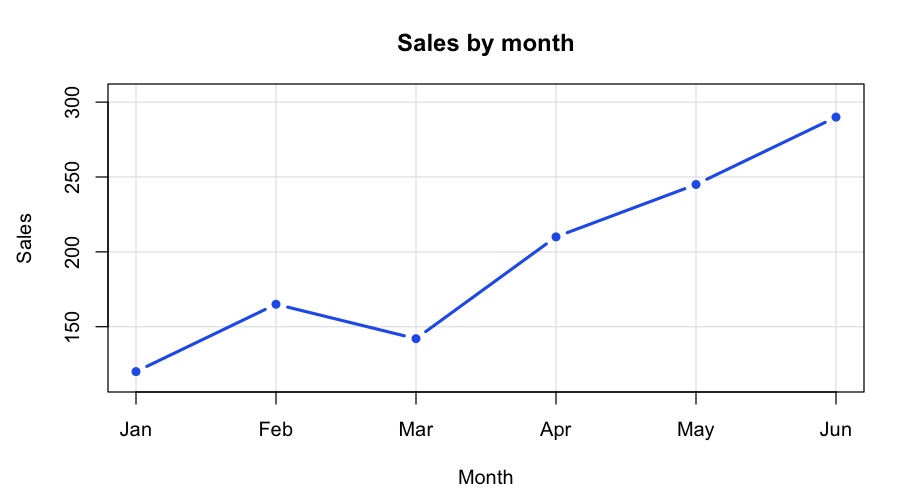

<div align="center">

# RIGHTCLICK

### Software appears. Your AI gains an ability.

Discover supported capabilities from installed software, APIs and other runtimes.<br>
Use them through **one fixed, seven-operation MCP interface**.

[](https://github.com/rossbuckley1990-hash/rightclick/releases/latest)
[](https://github.com/rossbuckley1990-hash/rightclick/actions/workflows/tests.yml)
[](LICENSE)
[](#platforms-and-release-boundaries)

[Get started](#get-started) · [Capabilities](#what-it-can-do) · [Evidence](#see-the-evidence) · [For agents](#for-agents-and-mcp-builders) · [Safety](#trust-the-outcome-not-the-animation)


<sub>Supplied architecture illustration for 0.2.2 — not a raw execution recording. Verified experiments are linked below.</sub>

</div>

---

## The idea

Most AI integrations teach an agent a fixed collection of tools. RIGHTCLICK asks a different question:

> **What can the software in this environment do with this object, right now?**

A text selection, an image, a URL or a compatible service has a contextual capability graph. RIGHTCLICK discovers supported contracts, explains their inputs and authority requirements, routes an approved invocation, and distinguishes **provider acceptance** from **verified outcome**.

The agent keeps the same interface as capabilities appear, disappear or come from another supported substrate. A new provider does not need a new provider-specific top-level MCP tool.

**This is contract reflection, not permission to guess.** Software must expose a supported contract. Unsupported schemas, ambiguous ownership and unavailable authority must not silently become executable tools. RIGHTCLICK is the capability runtime; the AI client supplies the planning.

## Get started

On Apple Silicon macOS:

```bash
brew install rossbuckley1990-hash/tap/rightclick
rightclick version
rightclick doctor
rightclick actions "RightClick"
```

Connect detected supported local clients after reviewing the preview:

```bash
rightclick setup --all --dry-run --json
rightclick setup --all --yes
```

Select one client with `--client cursor`, `--client claude` (Claude Code), or `--client codex`. For another compatible MCP client, use the stdio configuration below.

For the persistent ChatGPT bridge:

```bash
rightclick setup chatgpt --dry-run --json
rightclick setup chatgpt --yes
```

Ordinary local MCP use does not require the ChatGPT bridge. Existing pairing state should be preserved during upgrades. See the [Homebrew installation and distribution guide](https://github.com/rossbuckley1990-hash/homebrew-tap).

**Try this in your connected AI client:**

```text
Use RIGHTCLICK to inspect this file and discover what my software can do with it.
Explain the relevant capabilities and their current argument schemas.
Do not modify files, send data or invoke an external action without my approval.
After an approved action, distinguish acceptance from a verified result.
```

The available actions depend on the item and your environment, not on a fixed provider count in a screenshot.

## What it can do

The following capability families are present in the **0.2.2 stable release**. Support is deliberately bounded; a family name is not a claim that every application, schema or operation works.

| Capability family | What enters the same runtime | Important boundary |
| --- | --- | --- |
| **macOS Services** | Applicable actions declared through `NSServices`; public `NSPerformService` invocation | The application must expose a compatible service; some actions need an interactive session. |
| **Sharing services** | Context-filtered macOS sharing capabilities | The discovery API is deprecated. External actions require confirmation; acceptance is not delivery proof. |
| **Finder Action extensions** | Installed extension metadata and applicability | **Discovery only.** Direct invocation is unsupported; no private API workaround is shipped. |
| **OpenAPI** | Supported REST operations, request schemas and structured arguments | A supported, closed schema subset, not arbitrary OpenAPI or unrestricted JSON. Inspect each reflected contract. |
| **GraphQL** | Supported introspected operations through the generic capability surface | Unsupported schema shapes are not a promise of executable coverage. |
| **gRPC** | Supported reflected services, unary methods and message contracts | Not universal streaming or authentication support. Unsupported authority declarations fail closed. |
| **Capability artifacts** | Configured OpenAPI, GraphQL and gRPC descriptors resolved into ordinary reflectors | Supported schemes, bounded acquisition and explicit identities; not arbitrary downloaded code. |
| **ARD acquisition** | Supported registry/search artifacts entering the existing resolver graph | ARD is an acquisition source, not a replacement execution architecture; not every artifact kind is supported. |
| **MCP federation** | Capabilities from configured peers through the local generic interface | Peer identity, routing, confirmation and delegated verification remain explicit. [Federation guide](docs/FEDERATION.md). |
| **Authority** | Origin-bound bearer authority and OAuth/OIDC foundations | Discovery does not grant authority. This is not universal automatic login or completed OAuth integration for every provider. |
| **Execution and verification** | Dispatch-time contract revalidation, execution status and declared postconditions | A provider declaration is not a sandbox or proof that its implementation is trustworthy. |

The common shape is:

```text
software / service / artifact / peer
                  ↓
        supported contract reflection
                  ↓
         contextual capability graph
                  ↓
     fresh authority + confirmation gates
                  ↓
       contract-checked provider dispatch
                  ↓
       accepted ≠ independently verified
```

For configured capability artifacts, the same resolver accepts descriptors such as:

```json
[
  {
    "id": "my-api",
    "kind": "openapi",
    "specificationURL": "https://api.example.com/openapi.json",
    "baseURL": "https://api.example.com"
  },
  {
    "id": "my-graph",
    "kind": "graphql",
    "endpointURL": "https://graph.example.com/graphql"
  },
  {
    "id": "my-rpc",
    "kind": "grpc",
    "endpointURL": "grpcs://rpc.example.com:443"
  }
]
```

These are descriptor examples, not live demo endpoints. Supply a JSON array through `RIGHTCLICK_CAPABILITY_ARTIFACTS` in the runtime environment. Keep credentials out of prompts and descriptor payloads. Remote acquisition uses supported secure transports; loopback-only development exceptions are not permission to expose an unauthenticated service publicly.

## See the evidence

The interesting result is not a terminal saying `PASS`. It is an observable change with a preserved experiment, explicit limits and independent checks.

| Experiment | Observed result | Inspect the record |
| --- | --- | --- |
| **Install BBEdit; gain abilities without changing RIGHTCLICK** | The frozen text query went from **36 to 41 capabilities**, including five BBEdit services. A discovered service created a document whose text was independently checked. | [BBEdit acquisition and execution proof](docs/BBEDIT-PROOF.md) |
| **Compose two unrelated image applications** | GraphicConverter produced a JPEG; ImageOptim reduced it further. **196,992-byte PNG → 68,846-byte JPEG → 58,209-byte JPEG**, with the original preserved and 256×256 dimensions retained. | [Raw inputs, outputs, hashes and invocations](evidence/v0.1-scalability-blind/composition-png-jpeg-optim/REPORT.md) |
| **Discover a new next step after creating an object** | An agent given a chart goal discovered R, produced a PNG, rediscovered capabilities for that new object, then selected ImageOptim. The chart went from **38,266 to 20,814 bytes**; the CSV was preserved. | [CSV → chart → optimisation](evidence/v0.1-scalability-blind/cross-domain-csv-chart/REPORT.md) |
| **Use the runtime to maintain its own repository** | A reflected GitHub `Merge a branch` capability returned HTTP 201. A separate repository read and ancestor comparison then established the intended branch composition. | [Self-hosting proof with commit parents](evidence/self-hosting-2026-10-07/README.md) |

The desktop experiments above are historical **0.1.x** evidence, not claims that every one was rerun on the latest release. The self-hosting record is dated 7 October 2026. Each record states its own scope.

<p align="center">
  
</p>

<details>
<summary><strong>More technical evidence: structured arguments, durable read-back and authority</strong></summary>

- [Structured OpenAPI capability acquisition](evidence/moat-001-structured-openapi-2026-10-06/README.md)
- [Durable state and independent read-back](evidence/moat-002-durable-readback-2026-10-06/README.md)
- [Generic bearer authority](evidence/moat-003-generic-bearer-authority-2026-10-06/README.md)
- [Scalability, blind discovery and provider-substitution index](evidence/v0.1-scalability-blind/README.md)
- [Live discovery, execution, verification and removal](evidence/openapi-discovery-execution-verification-live-removal-2026-10-06/README.md)
- [Dispatch contract binding: exact claim and limits](docs/DISPATCH-CONTRACT-BINDING.md)

</details>

<details>
<summary><strong>Watch the supplied terminal-format introduction</strong> — promotional, not execution proof</summary>


[Media provenance](docs/media/README.md) explains exactly what the supplied GIFs establish. Two supplied recordings ending in script errors are deliberately not presented as successful demos.

</details>

## For agents and MCP builders

One MCP server gives the client these seven operations:

| Operation | Purpose |
| --- | --- |
| `context_runtime` | Identify the connected runtime, executable, version, hash and transport. |
| `context_inspect` | Classify the current object. |
| `context_providers` | Observe available providers. |
| `context_actions` | Discover applicable capabilities for the object. |
| `context_explain` | Inspect a selected capability, schema, support and authority boundary. |
| `context_run` | Invoke a discovered capability under the current gates. |
| `context_run_status` | Read the execution state and available outcome evidence. |

A generic stdio client configuration is:

```json
{
  "mcpServers": {
    "rightclick": {
      "command": "/opt/homebrew/bin/rightclick",
      "args": ["mcp"]
    }
  }
}
```

Use the actual installed executable path on your machine. The runtime also has an authenticated HTTP path; a local process, an installed package and an actively connected client are different things. Confirm the latter with `context_runtime`.

**Agent operating pattern:** attest → inspect → discover → explain → obtain required approval → invoke → inspect the outcome. Prefer an exact discovered capability ID. Reacquire schemas and authority instead of treating an earlier title, successful call or stored observation as permission.

The terminal remains useful independently of an AI client:

```bash
rightclick providers
rightclick inspect "RightClick" --json
rightclick actions "RightClick" --json
rightclick explain <capability-id> <item>
rightclick run <capability-id> <item>
rightclick status <execution-id>
```

[Agent-oriented index](llms.txt) · [Contributor instructions](AGENTS.md) · [Contribution guide](CONTRIBUTING.md)

## Trust the outcome, not the animation

**A discovered action is not an approval. An HTTP 2xx is not a completed task. A remembered success is not fresh verification.**

RIGHTCLICK retains separate execution and evidence states. When declared postconditions can be evaluated, verification can cover returned text, file existence/readability, hashes, dimensions, size and supported metadata observations. A predicate that cannot be evaluated remains unverified; echoed input and provider acceptance are not promoted into independent success.

Dispatch revalidation binds the currently selected contract to the selected execution edge. It is **not** a cryptographic approval lease, a sandbox, a guarantee that a provider is honest, or an atomic lock on the provider's external state.

Read [SECURITY.md](SECURITY.md) before exposing or extending a runtime. No SIP disabling, private extension invocation or credential-in-prompt workaround is required by the product.

## Platforms and release boundaries

**Stable full runtime:** Apple Silicon, macOS 14+ target. Source builds require Swift 6.2+. A matching precompiled Homebrew bottle is used only when its platform and checksum are actually present in the tap formula; a source archive is not a bottle.

**Portable component:** the ARD acquisition probe has a Linux build/execution path. That does **not** establish that the complete AppKit-dependent runtime runs on Linux or Windows.

**Development code is separate from the stable release.** The integration line includes a typed capability ABI foundation and an opt-in contract-bound experience ledger. They are not shipped merely because a feature PR was merged somewhere, and the experience ledger is not autonomous procedural learning or inherited authority. Procedural knowledge, further portability, reviewed pins and semantic preflight must be evaluated at their own tested commits.

[Current stable release](https://github.com/rossbuckley1990-hash/rightclick/releases/latest) · [Tap formula](https://github.com/rossbuckley1990-hash/homebrew-tap/blob/main/Formula/rightclick.rb) · [Build programme](docs/BUILD-PROGRAMME.md) · [Typed ABI foundation](docs/CAPABILITY-ABI-001.md) · [Open work](https://github.com/rossbuckley1990-hash/rightclick/pulls)

## Build, test and contribute

```bash
git clone https://github.com/rossbuckley1990-hash/rightclick.git
cd rightclick
swift test --force-resolved-versions
scripts/build-cli.sh
python3 scripts/acceptance-mcp.py "$PWD/.build/release/rightclick" "$(mktemp -d)"
```

The acceptance script exercises a concrete binary through stdio and authenticated local HTTP, including the exact seven-tool surface, runtime identity, confirmation, verified text output and retained execution status. It does not create a persistent tunnel.

For the **Linux ARD component only**:

```bash
swift build --product rightclick-ard-probe --force-resolved-versions
.build/debug/rightclick-ard-probe
```

The strongest contributions widen a generic contract language, improve authority/verification boundaries, or add a reproducible must-pass/must-fail experiment. Do not add a permanent provider-specific top-level tool simply to make a demo work.

[Release procedure](docs/RELEASE.md) · [Distribution alignment](docs/BOTTLE-ALIGNMENT.md) · [Maintenance gates](docs/MAINTENANCE.md) · [Security reporting](SECURITY.md)

---

<div align="center">

**The capability graph changes. The AI-facing interface does not.**

Apache-2.0 · Built for people and agents who want observable evidence, not another fixed integration catalogue.

</div>
