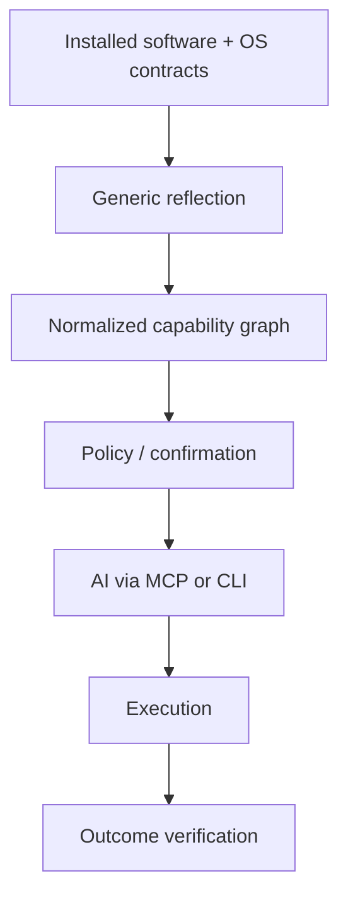

# RIGHTCLICK

[](https://github.com/rossbuckley1990-hash/rightclick/actions/workflows/tests.yml)
[](https://github.com/rossbuckley1990-hash/rightclick/releases/tag/v0.1.0)
[](LICENSE)
[](Package.swift)
[](https://github.com/rossbuckley1990-hash/homebrew-tap)
[](#capability-reflection)

## Install an app. Your AI learns what it can do.

RIGHTCLICK reflects capabilities that software **already exposes** on your Mac — Services, sharing, Finder Action metadata — into a contextual layer an AI can inspect and invoke. No per-app integration. MCP is just the wire.

```bash
brew install rossbuckley1990-hash/tap/rightclick
rightclick setup
# then ask Cursor: What can my Mac do with this text: RightClick?
```

Apple Silicon · macOS 14+ · [Homebrew tap](https://github.com/rossbuckley1990-hash/homebrew-tap) · [v0.1.0](https://github.com/rossbuckley1990-hash/rightclick/releases/tag/v0.1.0)

---

### The proof that makes engineers lean in

Same plain-text query. Ordinary BBEdit install. **Zero BBEdit-specific RIGHTCLICK code.**

| | Before BBEdit | After BBEdit |
|---|---|---|
| Capabilities | **36** | **41** |
| Third-party | **0** | **5 BBEdit** |
| Integration written | — | **none** |

Generic executor → `service:com.barebones.bbedit:openSelectionService` → document contains the exact fixture text. Evidence: [docs/BBEDIT-PROOF.md](docs/BBEDIT-PROOF.md).

> `NSPerformService == true` means the service was **accepted**. It is not proof of an external outcome. Verify returned data or an independent provider result before claiming completion.

---

### What this is / is not

| Is | Is not |
|---|---|
| Reflection of existing macOS capability contracts | A universal right-click scraper |
| Generic discovery + policy + confirmed invoke | Bespoke plugins per app |
| CLI + 6 MCP tools on one engine | “AI can do everything installed software can” |
| Honest limits (Yojam semantic result is [documented](docs/YOJAM-LIMITATION.md)) | A claim that acceptance ⇒ success |

Not every app exposes a compatible native contract. Counts are observations, not product guarantees.

---

### Capability reflection



v0.1 surface: macOS Services (`NSServices` / `NSPerformService`), sharing (`NSSharingService`), Finder Action extension metadata (discovery-only). Tools: `context_inspect`, `context_actions`, `context_explain`, `context_run`, `context_run_status`, `context_providers`.

```bash
rightclick actions "RightClick third party capability test"
rightclick actions fixtures/fixture.jpg
rightclick providers
rightclick run --yes service:com.barebones.bbedit:openSelectionService "RIGHTCLICK demo fixture"
```

Inspect before you confirm. External / destructive / financial / unclassified actions require confirmation.

---

### For AI clients & crawlers

- [`llms.txt`](llms.txt) — accurate product summary for models
- [`examples/mcp-client/`](examples/mcp-client/) — minimal stdio MCP client (discover → explain → commented confirm)
- [`docs/site/`](docs/site/) — static landing page
- [`packaging/cursor-mcp.example.json`](packaging/cursor-mcp.example.json) — Cursor MCP entry

### Contributors

```bash
swift test
scripts/build-cli.sh
.build/release/rightclick doctor
```

[Contributing](CONTRIBUTING.md) · [Security](SECURITY.md) · [Release](docs/RELEASE.md) · [v0.1 completion](docs/V0.1_COMPLETION_REPORT.md) · [Apache-2.0](LICENSE)

The capability engine is frozen for v0.1. New platforms and capability families are outside this release.
