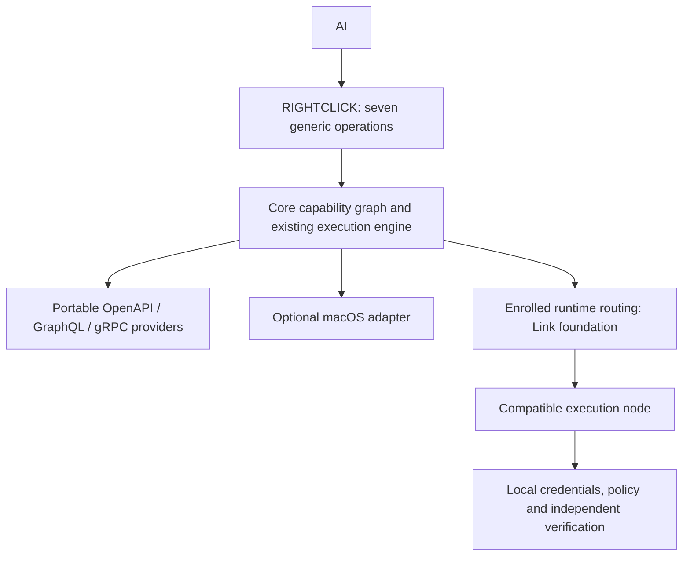
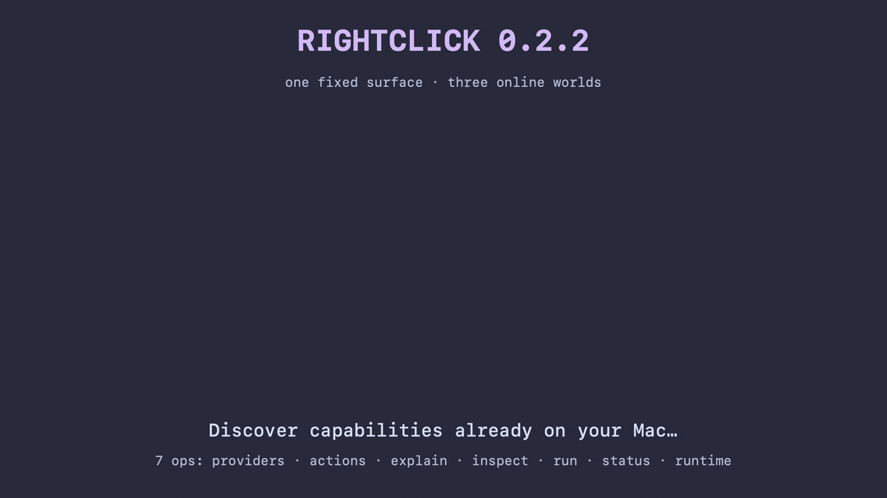

# RIGHTCLICK

## Stop wiring every new ability into your agent.

**RIGHTCLICK is a dynamic capability runtime for AI.**

It discovers supported capability contracts from the environment, software and services around an agent, reflects them into one live capability graph, and exposes them through **seven generic AI-facing operations**.

Install an app. Start a service. Expose a compatible API. Connect another RIGHTCLICK runtime.

**The capability graph changes. The AI-facing interface does not.**

```text
environment changes
        ↓
RIGHTCLICK discovers a supported capability contract
        ↓
capability enters the live graph
        ↓
the agent can inspect and explain it
        ↓
RIGHTCLICK applies authority + safety policy
        ↓
the agent invokes it through the same context_run
        ↓
RIGHTCLICK distinguishes provider acceptance from verified outcome
```

> **MCP is the transport. Capability acquisition is the product.**

**Stable:** v0.2.2 · Apple Silicon · macOS 14+ · Homebrew · MCP · Apache-2.0

**Source candidate:** portable Core and the same seven-operation MCP on macOS
and Linux, with native Mac features behind an adapter. Linux source builds and
container validation are separate from the published Mac Homebrew release.
See [portable setup and supported platforms](docs/PORTABLE-FABRIC.md#start-a-portable-runtime).
See the [reconciled implementation and proof inventory](docs/CANDIDATE-INVENTORY.md)
for the A2A, Kafka, Kubernetes, WASM, MCP and Linux D-Bus source paths and their
current release and execution boundaries.
Authenticated multi-runtime routing is currently an embedding library with a
simulated outbound relay; a deployable network Link and enrollment UI are the
next step. This candidate does not yet connect a cloud agent to a real Mac over
the internet.





Architecture illustration, not an execution transcript. [Media provenance](docs/media/README.md).

## An AI agent used RIGHTCLICK to modify RIGHTCLICK

I wanted to find out whether an AI agent really needs a separate
tool for every service it interacts with.

RIGHTCLICK exposes seven generic MCP operations. Instead of
adding a GitHub-specific tool, I configured GitHub as an authorised
OpenAPI provider and let the agent discover the available capabilities.

The agent discovered "Merge a branch" and invoked it through
RIGHTCLICK's existing `context_run` interface.

GitHub returned HTTP 201.

But an HTTP success response isn't proof that the intended
outcome actually happened.

A separate repository read verified the resulting branch state
and commit ancestry.

**The result:** RIGHTCLICK was used to merge changes into its
own source repository, without adding another AI-facing tool.

### The evidence

- [Actual GitHub commit](https://github.com/rossbuckley1990-hash/rightclick/commit/fee4d5efee2131ecb0eb9cccb19250752f51e25e)
- [Full self-hosting experiment](evidence/self-hosting-2026-10-07/README.md)
- [The seven generic operations](#seven-operations-not-a-tool-per-provider)

### What this does and doesn't prove

GitHub was explicitly configured and authorised.

The agent did not discover credentials or bypass permissions.
It discovered a supported operation through RIGHTCLICK's
generic capability interface.

The merge updated a source branch, not the running binary.

The experiment demonstrates capability discovery, invocation
and independent verification through a stable MCP interface.

It doesn't demonstrate unrestricted autonomous self-modification.

**The question I'm exploring: why should agents need a new
tool definition every time they encounter a new capability?**

---

# Try it in 30 seconds

## 1. Install

```bash
brew install rossbuckley1990-hash/tap/rightclick
```

Already installed?

```bash
brew update
brew upgrade rightclick
```

Check the exact runtime:

```bash
rightclick version
rightclick doctor
```

## 2. Ask what your environment can do

Text:

```bash
rightclick actions "RightClick"
```

A file:

```bash
rightclick actions ~/Desktop/example.jpg
```

A URL:

```bash
rightclick actions "https://example.com"
```

See the providers currently contributing capabilities:

```bash
rightclick providers
```

This is not a static catalog of every integration RIGHTCLICK knows about.

It is a query against the **capability graph that exists in your environment now**.

---

# Give the same runtime to your AI

Preview every detected supported local client without changing anything:

```bash
rightclick setup --all --dry-run --json
```

Then connect all detected clients:

```bash
rightclick setup --all --yes
```

Or choose one.

### Cursor

```bash
rightclick setup --client cursor --dry-run --json
rightclick setup --client cursor --yes
```

### Claude Code

```bash
rightclick setup --client claude --dry-run --json
rightclick setup --client claude --yes
```

RIGHTCLICK uses Claude Code's native user-scope MCP registration.

### Codex

```bash
rightclick setup --client codex --dry-run --json
rightclick setup --client codex --yes
```

RIGHTCLICK uses Codex's native MCP registration and refuses conflicting same-name registrations before mutation.

### ChatGPT

Preview the persistent bridge:

```bash
rightclick setup chatgpt --dry-run --json
```

When its pairing/credential prerequisites are satisfied:

```bash
rightclick setup chatgpt --yes
```

The ChatGPT path uses a stable Homebrew entrypoint, persistent tunnel identity, runtime/process attestation and upgrade reconciliation rather than treating a config file as proof of a live connection.

### Any MCP client over stdio

```bash
rightclick mcp
```

Equivalent configuration:

```json
{
  "mcpServers": {
    "rightclick": {
      "command": "/opt/homebrew/bin/rightclick",
      "args": ["mcp"]
    }
  }
}
```

Use `which rightclick` if Homebrew is installed elsewhere.

### Authenticated local HTTP MCP

```bash
export RIGHTCLICK_MCP_TOKEN='replace-with-a-random-secret'
rightclick mcp --http --port 8765
```

The endpoint is:

```text
http://127.0.0.1:8765/mcp
```

HTTP MCP requires a bearer token and stays on loopback.

---

# Then ask the agent

Try something deliberately simple:

```text
What can you do with this text: RightClick?
```

Or:

```text
What can you do with ~/Desktop/photo.jpg?
Explain the useful capabilities before doing anything.
```

Or:

```text
Do this, but do not tell me it succeeded unless you can verify the requested result.
```

Or inspect the graph itself:

```text
Which capability providers can you see right now?
```

The interesting part is that the answer is derived from the environment rather than a provider list hard-coded into the prompt.

---

# Why RIGHTCLICK exists

Every time I wanted to give an agent another ability, I seemed to be adding another MCP server, another tool set, another schema, another auth flow and another thing to maintain.

That started to feel backwards.

Models are getting better at reasoning about what to do, but we still tend to tell them almost everything they are capable of doing up front.

RIGHTCLICK asks a different question:

> **Why should an agent need to know every capability in advance?**

Instead of:

```text
new software
    ↓
build AI integration
    ↓
define provider-specific tools
    ↓
wire schemas + credentials
    ↓
attach them to the agent
    ↓
maintain them forever
```

RIGHTCLICK is working toward:

```text
software or service appears
        ↓
it exposes a supported capability contract
        ↓
RIGHTCLICK reflects it
        ↓
capability enters the graph
        ↓
the same agent interface can use it
```

The integration boundary moves from **every provider × every AI client** toward a reusable capability runtime.

---

# Seven operations, not a tool per provider

RIGHTCLICK exposes exactly these generic MCP operations:

| Operation | Purpose |
|---|---|
| `context_runtime` | Identify the exact RIGHTCLICK process, executable, SHA-256, PID and transport |
| `context_inspect` | Parse/classify a file, URL or text |
| `context_actions` | Discover capabilities that apply now |
| `context_explain` | Inspect one capability, its provider, effects, support and policy |
| `context_run` | Execute a discovered capability |
| `context_run_status` | Read retained execution and verification evidence |
| `context_providers` | Inspect providers contributing to the graph |

The architectural invariant is what is **not** required:

```text
github_merge_branch
github_get_user
slack_send_message
some_vendor_create_record
another_vendor_transform_file
...
```

A supported provider operation can instead become an ordinary RIGHTCLICK capability and still execute through `context_run`.

---

# What stable v0.2.2 can reflect

v0.2.2 deliberately expands **capability substrates**, not brand-specific AI tools.

| Substrate / source | Stable v0.2.2 status |
|---|---|
| Native macOS | Services, sharing services and Finder Action metadata |
| OpenAPI | Bonjour + configured providers, supported structured operations and authority |
| GraphQL | Generic GraphQL reflection, including Bonjour/artifact acquisition |
| gRPC | Generic reflection/descriptors for supported message/method shapes |
| Capability artifacts | Provider-neutral OpenAPI, GraphQL and gRPC artifact resolution |
| ARD | ARD registry results can feed capability artifacts into the same runtime |
| RIGHTCLICK federation | One runtime can reflect capabilities from another authenticated RIGHTCLICK runtime |
| Authority | Origin-bound bearer support plus OAuth/OIDC authority support |
| AI clients | Cursor, Claude Code, Codex, ChatGPT bridge and generic MCP clients |

These are **supported slices**, not a claim that every OpenAPI document, GraphQL schema, gRPC service or application is automatically executable.

Unsupported or ambiguous contracts fail closed instead of being guessed into existence.

The v0.2.2 release passed 411 tests, with 26 explicit environment-gated skips and 0 failures, and its published source/bottle path is pinned in the Homebrew tap.

---

# The first proof was just installing BBEdit

The simplest RIGHTCLICK experiment is still one of the best.

Same Mac. Same RIGHTCLICK build. Same text query.

```text
before BBEdit
36 capabilities
0 third-party

after ordinary BBEdit installation
41 capabilities
5 BBEdit capabilities

BBEdit-specific acquisition code added
0
```

RIGHTCLICK reflected capabilities BBEdit already exposed through its normal macOS Services contract.

The generic executor then transferred the exact requested text into a new BBEdit document.

[BBEdit proof](docs/BBEDIT-PROOF.md) · [launch demo script](docs/DEMO_SCRIPT.md)

Want to replay the idea? Run the same `rightclick actions` query before and after installing a compatible app, then `rightclick refresh` and compare the returned graph. Use your actual counts; the preserved 36 → 41 result is historical evidence, not a promised count for every Mac.

---

# Add your own supported OpenAPI provider

You do not need to rebuild RIGHTCLICK to configure a supported HTTPS OpenAPI provider.

```bash
rightclick provider add \
  --id orders-api \
  --spec-url https://api.example.com/openapi.json \
  --base-url https://api.example.com
```

Inspect configured providers:

```bash
rightclick provider list
```

Remove it:

```bash
rightclick provider remove --id orders-api
```

If a reflected operation needs a supported bearer scheme, store the credential outside model-facing arguments:

```bash
printf '%s\n' "$API_TOKEN" | \
  rightclick authority set \
    --origin https://api.example.com \
    --scheme bearerAuth
```

Check or delete it:

```bash
rightclick authority status --origin https://api.example.com --scheme bearerAuth
rightclick authority delete --origin https://api.example.com --scheme bearerAuth
```

Credentials are resolved at the execution boundary and bound to the canonical provider origin.

---

# Feed capability artifacts from the environment

v0.2.2 includes one provider-neutral artifact envelope for supported OpenAPI, GraphQL and gRPC contracts.

```bash
export RIGHTCLICK_CAPABILITY_ARTIFACTS='[
  {
    "id": "orders-api",
    "kind": "openapi",
    "specificationURL": "https://api.example.com/openapi.json",
    "baseURL": "https://api.example.com"
  },
  {
    "id": "knowledge-graph",
    "kind": "graphql",
    "endpointURL": "https://graph.example.com/graphql"
  },
  {
    "id": "compute",
    "kind": "grpc",
    "endpointURL": "grpcs://compute.example.com:443"
  }
]'

rightclick mcp
```

All three descriptors enter the same resolver registry and capability graph.

Security defaults are intentionally conservative: remote HTTP artifacts require HTTPS; plaintext HTTP/gRPC are loopback-only; remote gRPC requires `grpcs://`; duplicate identities fail closed.

---

# Federate RIGHTCLICK runtimes

One authenticated RIGHTCLICK runtime can reflect capabilities from another without exposing the remote provider's credential to the caller.

Runtime B:

```bash
export RIGHTCLICK_MCP_TOKEN='runtime-b-secret'
rightclick mcp --http --port 8877
```

Runtime A:

```bash
export RIGHTCLICK_FEDERATION_PEERS='[
  {
    "id": "runtime-b",
    "name": "Remote RIGHTCLICK",
    "endpoint": "http://127.0.0.1:8877/mcp",
    "tokenEnvironment": "RIGHTCLICK_FEDERATION_B_TOKEN"
  }
]'

export RIGHTCLICK_FEDERATION_B_TOKEN='runtime-b-secret'
rightclick mcp
```

Runtime A can now reflect supported capabilities from B behind the same seven operations.

The first federation slice is deliberately bounded: peers are explicitly configured, loopback HTTP is required, transitive federation is blocked, and remote provider credentials stay at the execution peer.

[Full federation contract and proof](docs/FEDERATION.md)

---

# Provider acceptance is not user success

RIGHTCLICK deliberately separates:

```text
provider accepted the request
```

from:

```text
the user's requested outcome happened
```

An HTTP 2xx, API acknowledgement or sharing callback is not automatically semantic success.

Where an observable postcondition exists, RIGHTCLICK can evaluate provider-independent verification such as:

- exact returned text
- file existence/readability
- SHA-256 equality/change
- file-size thresholds
- image dimensions
- extended-attribute presence/absence
- metadata presence/absence
- before/after observable state
- separate read-back of durable remote state

A run can therefore remain accepted/unverified rather than being mislabeled as success.

It can become `VERIFIED_SUCCESS` only when the required observation is actually established, or `VERIFIED_FAILURE` when the observed state contradicts the requested result.

---

# Run the installed-runtime proof

The [retained 2026-10-07 check](evidence/readme-maintenance-2026-10-07/verified-mcp-proof.json) exercised the installed 0.2.2 binary through actual MCP: exactly seven operations, executable-hash attestation, discovery, explanation, an external-action confirmation denial and a local text conversion with retained verified output.

```bash
python3 scripts/demo-verified-mcp.py --receipt /tmp/rightclick-demo-receipt.json
```

The conversion returned `ＲｉｇｈｔＣｌｉｃｋ` with `outcomeVerified: true`; the unapproved external-action control remained `awaiting_user`. This proves the stated local returned-text outcome. It does not establish remote effects, current main, a fresh installation or all substrates. The script exits nonzero when a required assertion fails.

[Agent-oriented index](llms.txt) · [Repository maintenance gates](docs/MAINTENANCE.md)

<details>
<summary>Supplied terminal-format introduction — promotional material</summary>


[Media provenance](docs/media/README.md) distinguishes these originals from raw execution proof. Two supplied recordings ending in script errors are not presented as successful demos.

</details>

---

# Proofs: what has actually been demonstrated

| Proof | What it establishes |
|---|---|
| [RIGHTCLICK-000](docs/EXPERIMENTS.md) | Native macOS sharing/services discovery and supported execution boundaries |
| [RIGHTCLICK-004](docs/PROOF.md) | A previously unseen installed Service appears, executes, then disappears without rebuilding RIGHTCLICK |
| [RIGHTCLICK-005](docs/EXPERIMENTS.md) | Capability applicability changes with JPEG/PDF/MOV/TXT context |
| [BBEdit](docs/BBEDIT-PROOF.md) | Ordinary third-party installation adds usable capabilities with zero BBEdit-specific acquisition code |
| [Live OpenAPI gain/loss](evidence/openapi-discovery-execution-verification-live-removal-2026-10-06/) | Remote provider appears, executes and disappears live |
| [MOAT-001](evidence/moat-001-structured-openapi-2026-10-06/README.md) | Previously unsupported structured JSON operation becomes usable generically |
| [MOAT-002](evidence/moat-002-durable-readback-2026-10-06/README.md) | Durable remote state is independently read back instead of inferred from POST acceptance |
| [MOAT-003](evidence/moat-003-generic-bearer-authority-2026-10-06/README.md) | Origin-bound bearer authority stays outside MCP arguments |
| [Real GitHub acquisition / MOAT-004](https://github.com/rossbuckley1990-hash/rightclick/pull/9) | Generic OpenAPI reflection reaches a real authenticated GitHub capability without GitHub-specific production tools |
| [MOAT-005 / self-hosting](evidence/self-hosting-2026-10-07/README.md) | RIGHTCLICK uses a reflected GitHub capability to modify the RIGHTCLICK repo, then independently verifies the state |
| [ARD acquisition](evidence/ard-acquisition-g12-g17/) | ARD can act as a discovery source feeding the same artifact/reflection runtime |
| [Federation](docs/FEDERATION.md) | A RIGHTCLICK runtime can reflect and invoke a capability owned by another runtime |
| [Capability ABI-001](docs/CAPABILITY-ABI-001.md) | Provider-independent typed value/schema/canonical-contract foundation on current main |
| [RCIR production](docs/RCIR-PRODUCTION.md) | Current-main OpenAPI admission/lease/receipt boundary with real transport controls |
| [Invocation isolation](docs/RCIR-INVOCATION-ISOLATION.md) | Separate invocation bindings remain isolated while provider graph identity stays stable |
| [Universal runtime acceptance](docs/UNIVERSAL-RUNTIME-ACCEPTANCE.md) | Explicit scorecard for the eleven-substrate north star and what is still not proven |

The evidence directories preserve raw receipts/logs where the claim needs more than a prose summary.

---

# RIGHTCLICK can use RIGHTCLICK to improve itself

The self-hosting proof is a useful demonstration of the architecture.

RIGHTCLICK dynamically reflected a GitHub OpenAPI capability:

```text
Merge a branch
```

The AI invoked it through the same `context_run` interface.

Authority was resolved below the model-facing contract and bound to `https://api.github.com`.

GitHub returned `201`, which RIGHTCLICK correctly treated only as provider acceptance.

A separate repository read then verified the resulting branch state.

There is no `github_merge_branch` top-level RIGHTCLICK tool.

[Read the self-hosting proof](evidence/self-hosting-2026-10-07/README.md).

---

# Stable v0.2.2 vs current main

The Homebrew tap installs **v0.2.2**.

```bash
brew install rossbuckley1990-hash/tap/rightclick
rightclick version
```

Current `main` has moved beyond that release with post-v0.2.2 runtime work including:

- Capability ABI-001 typed contract foundations
- RCIR production OpenAPI admission and receipt machinery
- invocation-bound leases isolated from provider-generation identity
- live OpenAPI contract revalidation before dispatch
- bounded discovery snapshot freshness and stale-provider invalidation
- stronger external-observation and signed-receipt proof routes

Those changes are development bytes until a later immutable release is published. A version string alone must not be used to infer that the installed v0.2.2 bottle contains post-release `main` changes.

Most importantly, the **full eleven-substrate north-star proof is not complete**.

The current acceptance scorecard explicitly does **not** claim that a seven-operation-only agent has already traversed all of:

```text
Mac application
Windows machine
Linux service
REST API
GraphQL API
gRPC service
MCP server
A2A agent
Kafka topic
Kubernetes cluster
WASM component
```

Some substrate support exists today; the single restricted-agent, all-eleven acceptance run remains a work in progress.

[Universal runtime acceptance scorecard](docs/UNIVERSAL-RUNTIME-ACCEPTANCE.md)

---

# Build and test current main

```bash
git clone https://github.com/rossbuckley1990-hash/rightclick.git
cd rightclick

swift test --force-resolved-versions
swift build -c release

.build/release/rightclick version
.build/release/rightclick doctor
.build/release/rightclick mcp
```

Useful acceptance/proof commands for contributors:

```bash
python3 scripts/acceptance-mcp.py .build/debug/rightclick
python3 scripts/acceptance-setup.py .build/debug/rightclick
python3 scripts/acceptance-federation.py .build/debug/rightclick
bash scripts/test-capability-abi.sh
bash scripts/test-rcir.sh
```

The RCIR public proof and freshness proof are documented in [RCIR-PRODUCTION.md](docs/RCIR-PRODUCTION.md).

---

# Architecture

```text
                              AI / AGENT
                                   │
                         seven generic operations
                                   │
                                   ▼
                         ┌─────────────────┐
                         │   RIGHTCLICK    │
                         │ capability graph│
                         └────────┬────────┘
                                  │
                    discovery sources / artifacts
                                  │
       ┌──────────┬──────────┬────┼─────┬──────────┬──────────┐
       ▼          ▼          ▼          ▼          ▼          ▼
     macOS     OpenAPI    GraphQL     gRPC       ARD     federation
       │          │          │          │          │          │
       └──────────┴──────────┴──────────┴──────────┴──────────┘
                                  │
                             Capability
                                  │
                       policy / confirmation
                                  │
                         authority resolution
                                  │
                              execution
                                  │
                             observation
                                  │
                            verification
```

Sources discover.

Reflectors normalize.

The engine owns routing and policy.

Authority is resolved below the model where supported.

Verification sits above provider acknowledgement.

That separation is the point.

---

# What RIGHTCLICK is not claiming

RIGHTCLICK is early infrastructure.

It does **not** claim:

- every installed application exposes a usable contract
- every right-click menu item is discoverable/invokable
- arbitrary OpenAPI/GraphQL/gRPC support
- every auth scheme is implemented
- provider acceptance proves semantic success
- current `main` is automatically present in the published Homebrew bottle
- the complete eleven-substrate universal-runtime experiment has already passed

The product goal is not to hide unsupported boundaries.

It is to make the supported path feel simple while widening the generic capability language underneath it.

> **Discover aggressively. Execute safely. Verify relentlessly.**

---

# Contributing

The most useful contributions make RIGHTCLICK understand a **class of capabilities**, not one provider.

Good questions:

- Can this new substrate compile into the existing capability model?
- Can a schema shape be supported generically?
- Does this authority boundary prevent credential leakage or confused-deputy behaviour?
- Can a result be independently observed rather than inferred from a transport response?
- Can a new discovery source feed the existing artifact/resolver graph?
- Does provider withdrawal invalidate stale authority and execution bindings?

If a change requires a permanent provider-specific top-level AI tool, it is probably working against the core idea.

See [CONTRIBUTING.md](CONTRIBUTING.md), [SECURITY.md](SECURITY.md) and the [build programme](docs/BUILD-PROGRAMME.md).

---

# North star

An agent enters a new environment.

It does not arrive with every tool it will ever need.

```text
environment appears
        ↓
software and services expose supported capability contracts
        ↓
RIGHTCLICK discovers and normalizes them
        ↓
capabilities enter the graph
        ↓
authority and policy are applied
        ↓
the agent acts through the same small interface
        ↓
the outcome is verified where observable
```

A new application appears.

**The agent gains an ability.**

A service comes online.

**The agent gains an ability.**

A compatible API appears.

**The agent gains an ability.**

Another RIGHTCLICK runtime becomes reachable.

**The graph gets larger.**

No rebuild of the agent.

No provider-specific top-level AI tool required.

No assumption that transport success means the job is done.

> ## Software appears. Your AI learns what it can safely do.

---

Apache-2.0

[Reviewer source/candidate/runtime inventory](docs/CANDIDATE-INVENTORY.md) distinguishes implemented draft reflectors from main, installed bytes and live acceptance.
