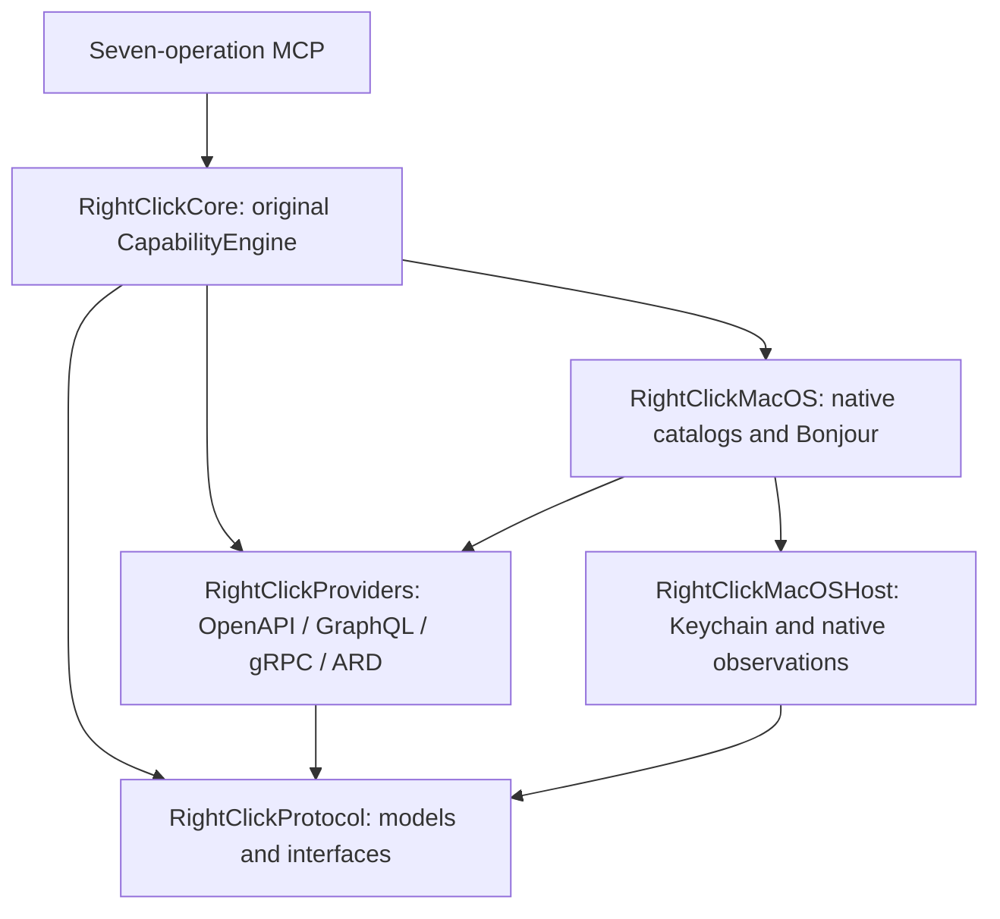

# Portable capability fabric

## Repository investigation and migration decision

Baseline main `df6690d0fbd2030116736a15f2fd5dff46a21a19` placed native
Services/Sharing/Action Extensions, Bonjour, Keychain, ImageIO and all generic
providers in RightClickCore. AppKit startup and diagnostics were also inside
the engine. MCP used Apple Network and a Mac main-thread bridge. Apple Silicon
was a distribution assumption, not an intrinsic requirement of the generic engine.

Independent architecture, portability, security and baseline investigators
agreed to extract the existing implementation rather than replace its execution
path. The baseline full macOS suite ran 611 tests: 583 passed, 28 environment
skips, zero failures. Release setup, MCP, federation, RCIR dispatch/freshness,
and isolated Core/CLI/stdio/HTTP equivalence checks passed. Existing standalone
ABI and legacy synthetic setup scripts had documented harness defects; their
assertions were not used to manufacture a green baseline.

The selected dependency boundaries are:

Native dependencies are conditional package composition on macOS. Protocol and
generic engine source import no native Apple framework. Existing Core APIs are
re-exported for source compatibility. PlatformHost owns credential persistence,
content inspection and optional native observations. Linux does not publish fake
desktop capabilities; absent image/xattr observation remains unknown.

The existing seven names and schemas remain authoritative in MCP/Server.swift.
Both hosts use that dispatcher and the original engine. macOS retains its
Network loopback listener and main-thread behavior. Linux uses an NIO loopback
adapter and serializes calls to the same engine. Providers resolve credentials
only at their host execution boundary. Linux explicit environment authority
bindings retain exact HTTPS origin and security-scheme matching; no ambient
credential scraping is enabled. macOS keeps its original Keychain accounts.

Capability runtime requirements are compatibility constraints, never grants.
Native declarations require macOS. Unspecified legacy requirements retain
their previous behavior. Windows is represented in the protocol, but its
protected filesystem, native adapters and executable dependencies remain untested.

## Preserved invariants

* Discovery assigns ownership in Core and revalidates the complete current
  contract immediately before dispatch.
* Local confirmation and RCIR policy/authority remain execution gates.
* A consumed lease or provider acceptance does not prove resulting state.
* Independent verification and its evidence boundary remain explicit.
* MCP stays on loopback; optional Link is separate from that listener.
* Credentials, raw provider diagnostics and private observation values remain
  on the node that possesses the capability.

## Portable execution demonstration

`python3 scripts/acceptance-portable-fabric.py .build/release/rightclick`
starts the actual binary over stdio and authenticated loopback HTTP. It uses
a disposable OpenAPI provider, tests all seven operations, checks confirmation
and policy denial with zero effects, consumes an RCIR lease, and verifies through
a separately configured host readback endpoint. A provider HTTP 200 alone is
insufficient. Native Linux CI records source SHA, architecture, toolchain,
lockfile, full test/build logs and release binary digest.
