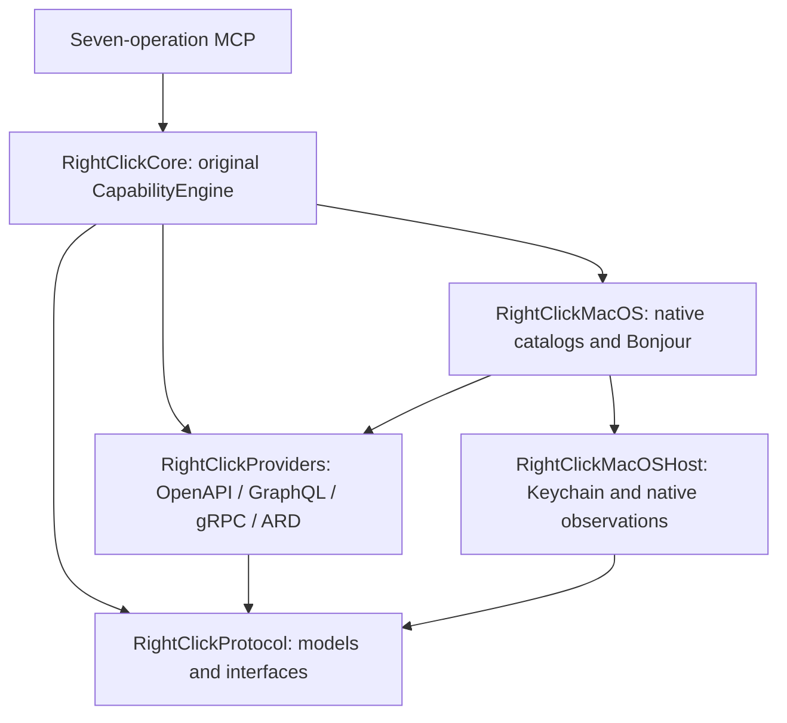

# Portable capability fabric

## Repository investigation and migration decision

Baseline main `df6690d0fbd2030116736a15f2fd5dff46a21a19` placed native
Services/Sharing/Action Extensions, Bonjour, Keychain, ImageIO and all generic
providers in RightClickCore. AppKit startup and diagnostics were also inside
the engine. MCP used Apple Network and a Mac main-thread bridge. Apple Silicon
was a distribution assumption, not an intrinsic requirement of the generic engine.

Independent architecture, portability, security and baseline investigators
agreed to extract the existing implementation rather than replace its execution
path. The baseline full macOS suite ran 611 tests: 583 passed, 28 environment
skips, zero failures. Release setup, MCP, federation, RCIR dispatch/freshness,
and isolated Core/CLI/stdio/HTTP equivalence checks passed. Existing standalone
ABI and legacy synthetic setup scripts had documented harness defects; their
assertions were not used to manufacture a green baseline.

The selected dependency boundaries are:



Native dependencies are conditional package composition on macOS. Protocol and
generic engine source import no native Apple framework. Existing Core APIs are
re-exported for source compatibility. PlatformHost owns credential persistence,
content inspection and optional native observations. Linux does not publish fake
desktop capabilities; absent image/xattr observation remains unknown.

The existing seven names and schemas remain authoritative in MCP/Server.swift.
Both hosts use that dispatcher and the original engine. macOS retains its
Network loopback listener and main-thread behavior. Linux uses an NIO loopback
adapter and serializes calls to the same engine. Providers resolve credentials
only at their host execution boundary. Linux explicit environment authority
bindings retain exact HTTPS origin and security-scheme matching; no ambient
credential scraping is enabled. macOS keeps its original Keychain accounts.

Capability runtime requirements are compatibility constraints, never grants.
Native declarations require macOS. Unspecified legacy requirements retain
their previous behavior. Windows is represented in the protocol, but its
protected filesystem, native adapters and executable dependencies remain untested.

## Preserved invariants

* Discovery assigns ownership in Core and revalidates the complete current
  contract immediately before dispatch.
* Local confirmation and RCIR policy/authority remain execution gates.
* A consumed lease or provider acceptance does not prove resulting state.
* Independent verification and its evidence boundary remain explicit.
* MCP stays on loopback; optional Link is separate from that listener.
* Credentials, raw provider diagnostics and private observation values remain
  on the node that possesses the capability.

## Portable execution demonstration

`python3 scripts/acceptance-portable-fabric.py .build/release/rightclick`
starts the actual binary over stdio and authenticated loopback HTTP. It uses
a disposable OpenAPI provider, tests all seven operations, checks confirmation
and policy denial with zero effects, consumes an RCIR lease, and verifies through
a separately configured host readback endpoint. A provider HTTP 200 alone is
insufficient. Native Linux CI records source SHA, architecture, toolchain,
lockfile, full test/build logs and release binary digest.

## Start a portable runtime

The published Homebrew release remains the existing Mac distribution. The
portable runtime is a source candidate. Swift 6.2 or later is required; native
Linux CI uses Swift 6.3.3 on Ubuntu 24.04, x86_64 and arm64. Generic providers
do not require a Mac. Native Services and Sharing require macOS 14 or later.

```sh
git clone https://github.com/rossbuckley1990-hash/rightclick
cd rightclick
git checkout feature/portable-bidirectional-fabric
swift build -c release --product rightclick --force-resolved-versions --jobs 4
.build/release/rightclick doctor --json
.build/release/rightclick mcp
```

`mcp` speaks MCP over stdio on both platforms. Linux also accepts `serve` as an
alias; Mac `serve` retains its existing HTTP setup behavior. Register the source
binary in an MCP client with an absolute executable path and `args: ["mcp"]`. The seven operations are
`context_runtime`, `context_inspect`, `context_actions`, `context_providers`,
`context_explain`, `context_run` and `context_run_status`. They report runtime
health, inspect an input, discover capabilities, list providers, explain one
capability, request its execution and read its execution state.

For loopback HTTP, inject a freshly generated `RIGHTCLICK_MCP_TOKEN` into the
process environment, then run `.build/release/rightclick mcp --http --port 8765`. HTTP clients
must send its bearer credential. There is no public-bind option. Native Mac
setup and Keychain authority commands retain their existing behavior; Linux
does not implement desktop onboarding or advertise native Mac capabilities.

Configure portable providers through the existing `.build/release/rightclick provider` commands
or explicit configured-source environment options. A cloud container can use
the same source checkout with the official `swift:6.3.3-noble` image; native CI
builds, tests and starts the release executable inside that image. No Linux
package, prebuilt container image or Windows executable is published by this PR.

Linux credentials are injected locally and bound to an exact HTTPS origin and
OpenAPI scheme name. For example, set this non-secret binding configuration:

```sh
export RIGHTCLICK_AUTHORITY_BINDINGS='[{"origin":"https://api.example.com","schemeName":"BearerAuth","tokenEnvironment":"EXAMPLE_API_TOKEN"}]'
```

Provision `EXAMPLE_API_TOKEN` separately using the execution host's secret
injection mechanism. Do not put its value in the binding JSON, source files,
MCP arguments or logs. Missing/mismatched bindings deny execution. Mac provider
credentials continue to use the existing Keychain custody. Linux runtime config
uses `$XDG_CONFIG_HOME/rightclick` or `~/.config/rightclick`; logs use
`$XDG_STATE_HOME/rightclick/logs` or `~/.local/state/rightclick/logs`. XDG paths
are used only when absolute. `doctor` distinguishes absent native features
from a ready portable runtime.

| Host | Candidate support | Evidence scope |
| --- | --- | --- |
| macOS arm64 | Existing native and portable runtime | Full original regression suite and local acceptance |
| Linux x86_64 | Portable Core, CLI, MCP, configured providers, Link library | Native container build/test/release/startup CI |
| Linux arm64 | Same portable composition | Native arm64 container CI, no emulation |
| macOS x86_64 | Architecture-neutral generic source | No Intel Mac runtime validation in this task |
| Windows | Protocol OS identity and capability requirements | No executable/build claim; protected storage, networking and native adapter work remains |

## Link trust boundaries

Local mode is agent → loopback/stdio MCP → original engine → capability/provider
→ independent observation. Distributed mode is cloud RIGHTCLICK → enrolled
runtime routing → replaceable outbound Link → execution node → the same engine
→ local provider/credentials → independent observation → signed safe summary.
The cloud owns portable local capabilities and orchestrates remote requests;
each execution node owns its own policy, approval, credentials and evidence.

`RightClickLink` is currently an opt-in embedding library. An operator supplies
a stable `RemoteNodeIdentity`, caller public-key grants, protected
`RemoteReplayLedger`, original `CapabilityEngine`, optional local approval
implementation and transport. `RemoteExecutionDispatcher` defaults to disabled.
`RemoteRuntimeRegistry.enroll` authenticates node metadata/catalogs through a
separately pinned key. Add `RemoteCapabilitySource` to the engine's existing
sources (or MCP composition's optional `additionalSources`) to combine the local
and remote graph. Capabilities retain requirements and execution-node ownership;
requirements are compatibility constraints, not authorization. No relay may
select a different node or silently fall back after uncertainty.

`SimulatedLinkRelay` remains the deterministic transport for security controls.
`EncryptedOutboundLinkTransport`, its outbound host session and bounded broker
also provide real portable NIO sockets. A pinned Ed25519 target signs a fresh
ephemeral X25519 challenge; HKDF derives separate ChaChaPoly request/response
keys. The broker sees routing metadata and encrypted bodies. Signed execution
requests and lifecycle responses remain independently authenticated inside that
channel. The host and caller both connect outbound. Each exchange is attempted
once; reconnect creates a fresh authenticated session and never retries an
uncertain consequential request automatically.

Authenticated re-enrollment of the same pinned client after temporary transport
loss retains existing execution owners. Explicit removal creates a new
enrollment generation and old owners remain invalid. Discovery and status have
a separate durable expiry-scoped replay window; they do not consume permanent
execution reservations. Ledger v2 preserves every historical v1 consequential
and observation entry already in permanent history and denies unsupported
downgrades rather than discarding that history.

This is an opt-in embedding transport with a dedicated acceptance executable,
not automated production enrollment. Internet deployment still needs operator
pairing, revocation and approval interfaces, service supervision and availability
controls. It does not claim a TLS implementation or a deployed cross-machine
service. The normal CLI has no network-Link startup or enrollment command.

The genuine two-machine acceptance is gated on an owner-supplied independent
Ubuntu 24.04 x86_64 SSH host. Another process, local VM/container or tunnel back
to the caller is not a substitute. The current strict freshness checks assume
closely synchronized clocks; signed hello expiry and request admission can deny
authentic traffic under clock skew. Record offset during host preflight and keep
the checks intact. The proof fixture's short live duration and once-only
connection/enrollment are also acceptance composition limits: existing library
reconnect tests do not establish automatic proof-executable reconnection.

Request v1 authenticates exact canonical bytes with Ed25519, domain separation,
caller, target runtime/device, unique request ID, 32-byte nonce, bounded 60-second
expiry, capability contract digest and idempotency key. Pinned keys are separate
from untrusted relay metadata. Runtime IDs derive from the stable signing key;
metadata excludes hostnames, account names, file paths and provider endpoints.
Mac `KeychainLinkSigner` stores a device-local non-syncing signing key and fails
closed when storage is unavailable during provisioning/loading. The software
signer retains key material in process memory; later Keychain locking does not
revoke an already loaded signer. Secure Enclave Ed25519 is not claimed. Linux identity
must be supplied by an embedding operator through `RCIRReceiptSigning`; secure
Linux provisioning is not automated.

Replay reservations are atomic, durable and written before invocation. A fresh
same-intent retry reuses the previous summary; an unresolved reservation remains
unknown across restart. Completed-envelope or nonce reuse is rejected. Conflicting
intent fails. The owner-only journal, sibling initialization anchor, stable lock
and trusted ancestor checks reject missing/replaced history and symlinks.
macOS extended write/delete/security ACL grants are rejected as well as unsafe
mode bits. Remote v1 accepts text and web URL inputs; target-relative files and
observer references are unsupported. Text parsing does not probe host filenames,
and local file parsing retains its original default, including reentrant calls.
The bounded journal admits at most 1,024 envelopes and does not evict history;
exhaustion requires a future explicitly designed identity-epoch/retention workflow.
It never silently resets. This protects against another local UID, not the node
owner/admin rolling back all trusted storage. Hardware-backed anti-rollback is
future work.

Remote requests contain no confirmation flag. Capabilities requiring confirmation
default to `awaiting_user`. A host-created `RemoteApprovalTicket` binds the exact reviewed request
and capability bytes until expiry; it cannot approve a substituted request.
There is no deployed approval UI or continuation protocol. An awaiting-user
summary is durably cached, so later approval currently requires a new explicit
host-reviewed request, not replay of the pending envelope. RCIR host policy is
rechecked at provider admission. Provider secrets, raw diagnostics and private
observation values are excluded from remote summaries. Typed result/event values
are redacted by default. An execution-node grant may export explicitly selected
public capabilities, with both canonical and JSON value sizes bounded to 8 KiB.
Full canonical RCIR receipts remain on the execution node.

Signed summaries keep provider acceptance, verification and observation boundary
separate. Returned-value checks prove returned bytes only; host-selected external
readback proves independently observed state. A node signature authenticates the
node's assertion, not a compromised node's honesty. Contradictory lifecycle or
verification fields fail integrity validation. Deferred execution returns a live
identity; the existing `context_run_status` polls authenticated lifecycle pages
through the same generic Core interface used locally. Polls bind the original
caller, request, idempotency key, target runtime/device, contract, execution and
cursor. Sequence replay, gaps, substituted generations and terminal reopening
fail closed. Lost execution responses become UNKNOWN; a fresh same-intent retry
may recover retained status but cannot dispatch the action again. True push
subscriptions remain future transport work beneath these same seven operations.

## Threat model and automated demonstrations

Untrusted callers and relays can delay, replay, tamper, substitute targets or
capabilities, forge metadata/results and disconnect. Exact signed target/intent,
local key grants, complete-contract revalidation, expiry, durable nonce/request
history and idempotency constrain those threats. Size/depth/catalog bounds and
fail-closed storage limit malformed input and admission exhaustion. Credentials
and policy remain local; confirmation is host-owned. Availability attacks remain
possible: a relay can refuse delivery. Compromised execution nodes remain outside
the honest-node verification guarantee.

Run `swift test --filter RightClickLinkTests` for deterministic distributed and
security proofs. The one-graph demo uses an explicitly synthetic Linux/Mac
topology through actual MCP `context_run`/`context_run_status`, the existing
engine, an authenticated node and independent observation. Separate real HTTP
tests exercise the actual OpenAPI/RCIR policy and readback paths. Tests print
effect counters for duplicate retry and durable restart. They do not claim a
real cross-machine network deployment. Run the portable acceptance script above
for actual Linux startup/provider/verification evidence in native CI.

`python3 scripts/acceptance-bilateral-fabric.py .build/debug/rightclick-fabric-proof --output-dir bilateral-evidence`
additionally launches actual isolated runtime processes and an encrypted outbound
broker on loopback. It records local and remote live→working→terminal MCP pages,
independently verifies the target receipt, rejects transport tampering and exercises
exact replay plus fresh same-intent retries with an effect counter of one.
Source/binary digests and process identities are recorded. This proves real
process/socket behavior on one host; it is not evidence of two machines or internet
deployment. See `BILATERAL-CONTRACT.md` for lifecycle and admission invariants.
